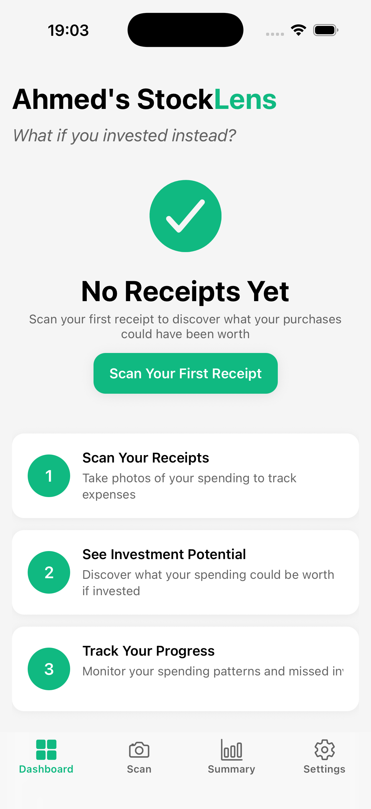
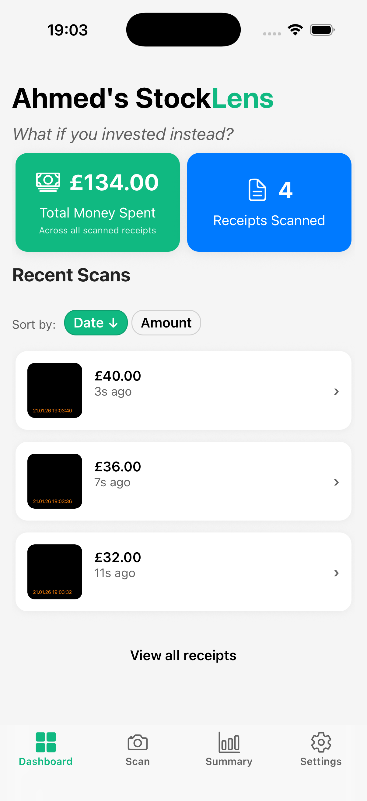

# StockLens

Scan Your Spending, See Your Missed Investing

StockLens is a mobile application built with React Native and Expo that helps users analyze their spending habits by scanning receipts using OCR (Optical Character Recognition) technology. The app identifies potential investment opportunities based on the user's spending patterns and provides insights into how small changes in daily expenses can lead to significant investment growth over time.

## Screenshots

Below are a few screenshots showing the StockLens app UI. The images are referenced from `assets/screenshots/` — add the actual image files there (for example `screen1.png`, `screen2.png`, etc.) so they display on GitHub.

- Welcome Screen


- Empty state / onboarding



- Dashboard overview



- Receipt Details Screen


## How to Run

Prequisites:

- Node.js (LTS recommended, e.g. Node 18+)
- npm (bundled with Node) or Yarn
- An Android/iOS emulator OR the Expo Go app on your phone

To run the StockLens app locally, follow these steps:

1. Clone the repository
2. Install dependencies (you may need to update them)

    ```bash
    npm install
    npm update
    ```

3. Launch the Expo server

    ```bash
    npm start
    ```

4. Run the app

   - For iOS simulator: Press `i` in the terminal
   - For Android emulator: Press `a` in the terminal
   - For physical device: Scan the QR code with the Expo Go app to launch the app

## Testing

To run the test suite for StockLens, follow these steps:

1. Ensure all dependencies are installed by running:

    ```bash
    npm install
    ```

2. Run the tests using the following command:

    ```bash
    npm test
    ```

3. To run only unit tests, use:

    ```bash
    npm test unit
    ```

4. To run only integration tests, use:

    ```bash
    npm test integration
    ```

## Test Suite Structure

The test suite is organized within the `src/__tests__/` directory, which contains the following subdirectories:

- `fixtures/`: Contains mock data used across multiple tests, such as sample receipts, user data, OCR responses, and stock data.
- `contexts/`: Tests for context providers like authentication and theming.
- `hooks/`: Tests for custom React hooks used in the application.
- `screens/`: Tests for user interface screens and workflows, including login, scanning, and dashboard functionalities.
- `services/`: Tests for business logic components, including OCR processing, investment projections, and database interactions.
- `utils/`: Tests for utility functions such as data formatters and helpers.
Each test file is named according to the component or functionality it tests, making it easy to locate and understand the purpose of each test. The tests utilize Jest's features, including mocking and assertions, to validate the behavior of the app's components and services.
