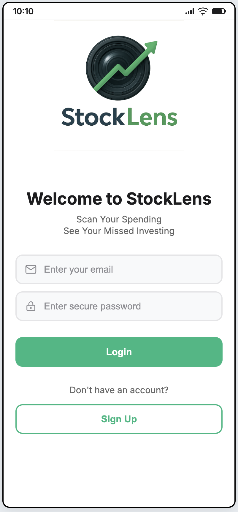
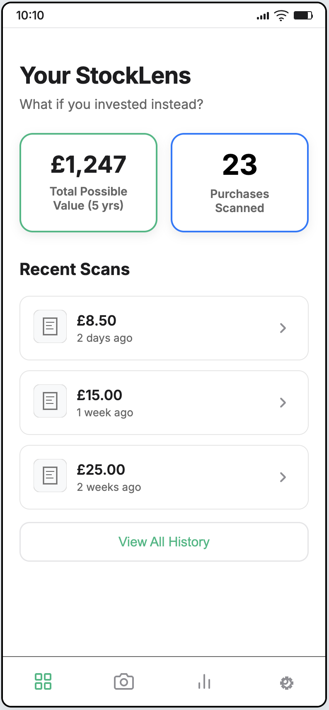
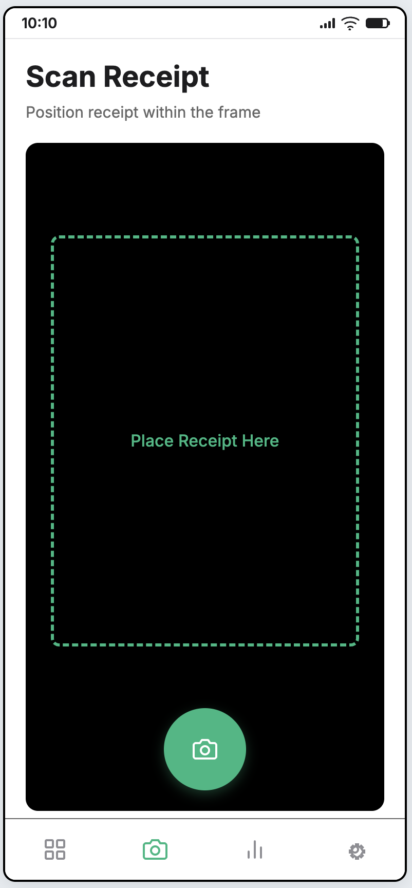
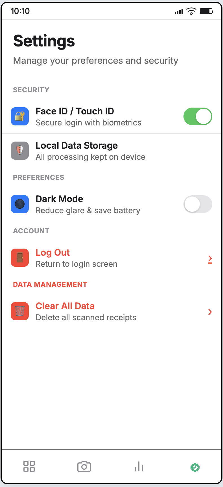
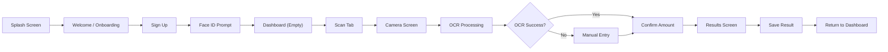
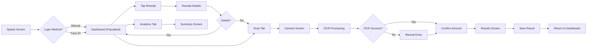

# StockLens

> Full-stack mobile FinTech app that transforms physical receipts into investment opportunity analysis - OCR pipeline extracts receipt totals, Alpha Vantage API maps spending to stock tickers, and ARIMA + Linear Regression projects historical and future portfolio growth. Built in React Native/TypeScript with biometric auth, AES-256 encryption, and 78 Jest tests.

<p align="center">
  
  
  
  
  
</p>

## Documentation

**[→ Design Proposal](https://github.com/AhmedIkram05/stocklens/blob/docs/README.md/assets/Design%20Proposal.pdf)**

**[→ Project Report](https://github.com/AhmedIkram05/stocklens/blob/docs/assets/Project%20Report.pdf)**

---

## Demonstration

| Landing | Login | Sign Up |
|---|---|---|
|  |  |  |

| Dashboard (Empty) | Dashboard (Populated) | Scan Receipt |
|---|---|---|
|  |  |  |

| Receipt Details | Results | Summary |
|---|---|---|
|  |  |  |

| Summary (cont.) | Settings |
|---|---|
|  |  |

---

## What StockLens Does

Most finance apps show you what you've spent. StockLens shows you what you *missed*.

Scan any receipt → StockLens extracts the total → queries historical stock data → shows you: *"That £40 takeaway, invested in NVIDIA 5 years ago, would now be worth £240."* Then projects forward: *"Invested today, it could be worth £65 in 5 years."*

The goal is making opportunity cost tangible and emotionally engaging — turning abstract financial concepts into l, visual, data-driven insights from a user's own spending history.

---

## Architecture

```
stocklens/
├── src/
│   ├── __tests__/              # 78 Jest tests
│   │   ├── fixtures/           # Mock receipts, users, OCR responses
│   │   ├── hooks/              # Custom hook tests
│   │   ├── screens/            # Screen and workflow tests
│   │   └── services/           # OCR, projections, database logic tests
│   ├── components/             # Reusable UI components
│   ├── screens/                # App screens (Dashboard, Scan, Results, Summary, Settings)
│   ├── services/
│   │   ├── ocr/                # OCR Space API integration + parsing pipeline
│   │   ├── projections/        # ARIMA forecasting + Linear Regression
│   │   ├── stocks/             # Alpha Vantage API + CAGR calculation + caching
│   │   └── database/           # SQLite local storage + AES-256 encryption
│   ├── hooks/                  # Custom React hooks (useProjections, useReceiptHistory)
│   └── utils/                  # Currency formatters, date helpers, validators
├── assets/                       
        ├── screenshots/        # Demo of entire app
│       └── wireframes/         # Custom designs of entire app            
├── app.json                    # Expo configuration
└── package.json
```

**Strict UI / Logic / Data separation** — screens never call APIs directly. Services are injected via hooks, making every layer independently testable. This is why 78 Jest tests can cover OCR fallbacks, API caching, crypto roundtrips, and auth flows without needing a running device.

---

## Design Decisions

**Privacy-by-design — all processing on-device**
Receipt images are processed locally via OCR Space API over HTTPS and immediately discarded — no receipt photos are stored or transmitted to any backend. All receipt history and projections are stored in an encrypted local SQLite database (AES-256). No sensitive purchase data ever leaves the device. This eliminates GDPR data breach risk by design rather than policy.

**AES-256 encryption for financial data at rest**
SQLite database is encrypted with AES-256 before being written to device storage. Financial data (spending amounts, stock projections, receipt history) is sensitive enough to warrant encryption even on a locked device — the encryption key is derived from the user's biometric authentication, not stored in plaintext.

**Biometric authentication via platform-native APIs**
Face ID (iOS Local Authentication framework) and Touch ID/fingerprint (Android BiometricPrompt API) provide frictionless, secure login without storing credentials locally. The auth token is held in secure enclave — not in AsyncStorage or any inspectable location.

**OCR pipeline with manual fallback**
The OCR pipeline (OCR Space API) handles the common case. Thermal paper receipts, poor lighting, and handwritten amounts fail OCR at a meaningful rate — so a manual entry modal is always available as a fallback. The confirmation screen ("Is this correct?") before running projections ensures users catch OCR errors before they affect their history. This design prevents silent bad data entering the database.

**ARIMA for historical, Linear Regression for forward projection**
Historical spending-to-investment analysis uses actual Alpha Vantage price data — no modelling required, just lookup and CAGR calculation. Forward projections are a different problem: ARIMA captures time-series spending patterns (weekly seasonality, monthly trends) to forecast per-category spend, while Linear Regression projects portfolio value forward based on historical CAGR. Each model is used where it's appropriate rather than applying one approach to both problems.

**Alpha Vantage response caching**
Stock price API responses are cached locally in SQLite with a TTL. This avoids hammering the free-tier rate limit (500 requests/day) and makes the results screen load instantly on repeat visits. Cache invalidation runs on app foreground if TTL has expired.

**Offline-first core flow**
The scan → OCR → confirm → project flow works without internet using cached stock data. API calls are queued and executed when connectivity is restored. A "Using estimated data" disclaimer surfaces when cached data is being used for projections.

**78 Jest tests across 4 concern layers**
Tests are organised by concern — not by file. OCR fallback logic, API caching behaviour, AES encryption roundtrips, and auth flows are all tested in isolation via mocked dependencies. This means the test suite runs in milliseconds without network calls and catches regressions in business logic before they reach the device.

---

## New User Flow


```mermaid
flowchart LR
    A["Splash Screen"] --> B["Welcome / Onboarding"]
    B --> C["Sign Up"]
    C --> D["Face ID Prompt"]
    D --> E["Dashboard (Empty)"]
    E --> F["Scan Tab"]
    F --> G["Camera Screen"]
    G --> H["OCR Processing"]
    H --> I{"OCR Success?"}
    I -- Yes --> J["Confirm Amount"]
    I -- No --> K["Manual Entry"]
    K --> J
    J --> L["Results Screen"]
    L --> M["Save Result"]
    M --> N["Return to Dashboard"]
```

## Returning User Flow


```mermaid
flowchart LR
    A["Splash Screen"] --> B{"Login Method?"}
    B -- Manual --> C["Dashboard (Populated)"]
    B -- Face ID --> C

    C --> D["Tap Receipt"]
    D --> E["Receipt Details"]
    E --> F{"Delete?"}
    F -- Yes --> C
    F -- No --> G["Scan Tab"]

    C --> G
    G --> H["Camera Screen"]
    H --> I["OCR Processing"]
    I --> J{"OCR Success?"}
    J -- Yes --> K["Confirm Amount"]
    J -- No --> L["Manual Entry"]
    L --> K
    K --> M["Results Screen"]
    M --> N["Save Result"]
    N --> O["Return to Dashboard"]

    C --> P["Analytics Tab"]
    P --> Q["Summary Screen"]
```

---

## App Map

**4 primary tabs (persistent bottom navigation):**

| Tab | Screens | Purpose |
|---|---|---|
| Dashboard | Empty state, Populated list, Receipt Details | Receipt history and individual projections |
| Scan | Camera, OCR Processing, Confirmation, Results, Error State, Manual Entry | Core scan-to-projection flow |
| Analytics | Summary Screen (stats, top stocks, insights) | Aggregate spending and opportunity analysis |
| Settings | Settings, Log Out Confirmation, Clear Data Warning | Account management and privacy controls |

Max 3 taps deep from any tab. Core scan function always 1 tap away. Tab bar always visible — context preserved when switching sections.

---

## MVP Features

| Feature | Implementation |
|---|---|
| Sign Up / Login | Firebase Authentication — email/password + biometric |
| Receipt Scanning | OCR Space API via Expo Camera — guide overlay, instant extraction |
| Manual Entry Fallback | Modal input when OCR fails or thermal paper unreadable |
| Confirmation Screen | Review extracted amount before running projections |
| Investment Projections | Alpha Vantage historical data + CAGR + ARIMA + Linear Regression |
| Results Screen | Historical (what you missed) + forward (what you could gain) — 1Y/3Y/5Y/10Y/20Y |
| Save Receipt | Encrypted SQLite local storage — no cloud required |
| Receipt Details | Individual projection view with delete option |
| Dashboard | Cumulative missed opportunity total, purchases scanned, recent scan list |
| Summary / Analytics | Total spent, total missed opportunity, top performing stocks, investment insights |
| Settings | Face ID toggle, dark mode, log out with confirmation, clear all data with warning |
| Offline Functionality | Cached stock data — core flow works without internet |
| Error Handling | OCR failure → manual entry, API failure → cached data + disclaimer, network error → queue |

---

## Security & Privacy

| Concern | Implementation |
|---|---|
| Data storage | AES-256 encrypted SQLite — local only, no cloud sync in MVP |
| Authentication | Firebase Auth (bcrypt hashing) + Face ID/Touch ID via platform-native APIs |
| Receipt images | Processed via OCR over HTTPS, immediately discarded — never stored |
| Stock API keys | Environment-secured, never exposed in client code |
| Financial calculations | Performed locally using cached data — minimises external dependencies |
| GDPR compliance | No personal data transmitted externally; all processing on-device |
| Projections disclaimer | "Hypothetical educational tool — not FCA-regulated investment advice" shown on every results screen |
| Destructive actions | Log out and clear data both require confirmation modals — no accidental data loss |

---

## Testing

78 Jest tests across 4 concern layers:

| Layer | Coverage |
|---|---|
| OCR service | Successful extraction, fallback on failure, amount parsing edge cases |
| Stock/projection service | API caching, CAGR calculation, ARIMA output validation, cache TTL expiry |
| Crypto service | AES-256 encryption roundtrips, key derivation, decryption failure handling |
| Auth flows | Login, signup, biometric prompt, session persistence, logout |

```bash
npm test              # Full test suite (78 tests)
npm test unit         # Unit tests only
npm test integration  # Integration tests only
```

---

## Getting Started

### Prerequisites

- Node.js 18+ (LTS)
- npm or Yarn
- Expo Go app (physical device) or iOS Simulator / Android Emulator

### 1. Clone & install

```bash
git clone https://github.com/AhmedIkram05/StockLens.git
cd StockLens
npm install
```

### 2. Environment setup

Create a `.env` file at the repo root:

```bash
ALPHA_VANTAGE_API_KEY=your_key_here
OCR_SPACE_API_KEY=your_key_here
FIREBASE_API_KEY=your_key_here
# ... see .env.example for full list
```

### 3. Run

```bash
npm start

# Then:
# Press i → iOS Simulator
# Press a → Android Emulator
# Scan QR code → Expo Go on physical device
```

---

## Tech Stack

| Layer | Technology |
|---|---|
| Framework | React Native (Expo) — iOS & Android |
| Language | TypeScript — strict mode throughout |
| Auth | Firebase Authentication + Face ID/Touch ID |
| Database | SQLite (local, AES-256 encrypted) |
| OCR | OCR Space API |
| Stock data | Alpha Vantage API (historical prices, CAGR) |
| ML / Projections | ARIMA (spending forecasting), Linear Regression (portfolio projection) |
| Camera | Expo Camera / Image Picker |
| Testing | Jest — 78 tests across OCR, crypto, stocks, auth |

---

## Currently Extending

- Migrating from Firebase to a self-hosted FastAPI/PostgreSQL backend for production-grade data handling and cross-device sync
- ML-driven spending analytics with category auto-classification
- Forward-looking portfolio projections surfaced in a redesigned dashboard

---

## Related Projets From Me

- [DevSync — Project Tracker with GitHub Integration](https://github.com/AhmedIkram05/DevSync) - full-stack cloud app with 541 automated tests
- [ATM Log Aggregation & Diagnostics Platform](https://github.com/AhmedIkram05/laad) - production data engineering with RAG diagnostic assistant
- [W3C Web Logs ETL Pipeline](https://github.com/AhmedIkram05/W3C-ETL-Pipeline) - parallel Airflow ETL with Power BI analytics
