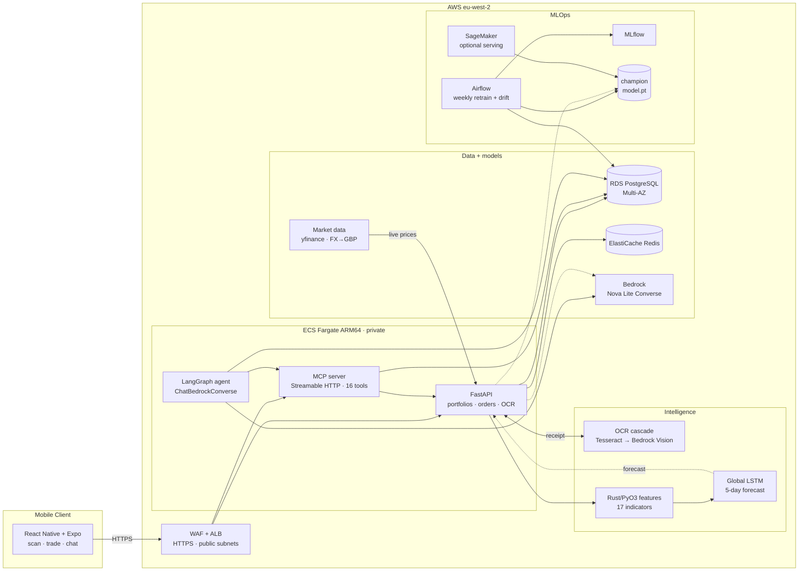
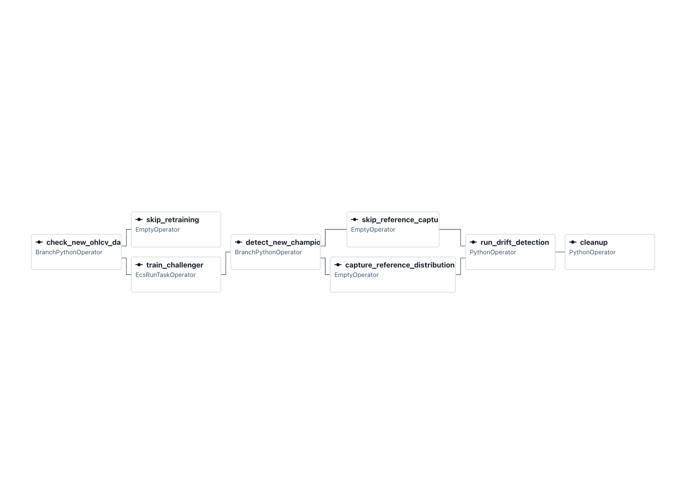
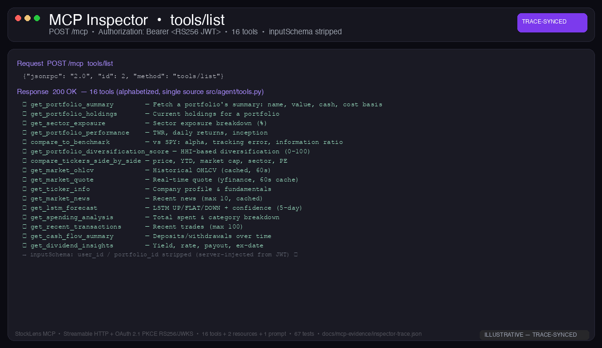
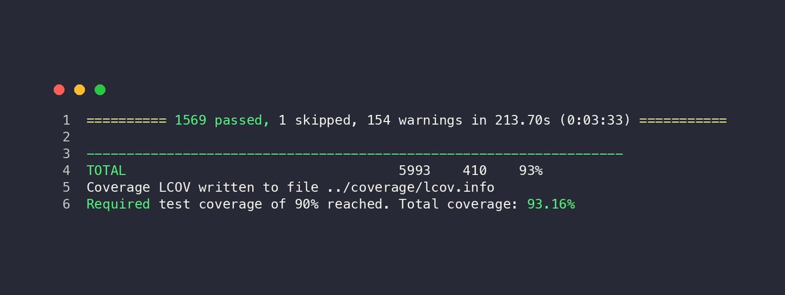

# StockLens

> Scan receipts → trade stocks with your spending → track portfolios with LSTM forecasts, AI agent & MCP tools. Built with FastAPI, PyTorch, LangGraph, Rust, Terraform, MCP.

<p align="center">
<a href="https://www.python.org/"></a>
<a href="https://fastapi.tiangolo.com/"></a>
<a href="https://www.typescriptlang.org/"></a>
<a href="https://reactnative.dev/"></a>
<a href="https://www.rust-lang.org/"></a>
<a href="https://www.langchain.com/langgraph"></a>
<a href="https://pytorch.org/"></a>
<a href="https://modelcontextprotocol.io/"></a>
<a href="https://oauth.net/2/"></a>
<a href="https://aws.amazon.com/"></a>
<a href="https://aws.amazon.com/bedrock/"></a>
<a href="https://aws.amazon.com/sagemaker/"></a>
<a href="https://www.terraform.io/"></a>
<a href="https://www.docker.com/"></a>
<a href="https://www.postgresql.org/"></a>
<a href="https://redis.io/"></a>
<a href="https://airflow.apache.org/"></a>
<a href="https://github.com/features/actions"></a>
<a href="https://mlflow.org/"></a>
<a href="https://optuna.org/"></a>
<a href="https://expo.dev/"></a>
</p>

<p align="center">
  <a href="https://github.com/AhmedIkram05/stocklens/actions/workflows/ci.yml">
    
  </a>
  <a href="https://github.com/AhmedIkram05/stocklens/actions/workflows/codeql.yml">
    
  </a>
  <a href="https://codecov.io/gh/AhmedIkram05/stocklens">
    
  </a>
</p>

<br/>

**StockLens turns your spending into an investment workflow.** Scan a receipt, the OCR cascade extracts the total into investable cash, and you can immediately buy or sell real stocks at **live market prices** (FX-adjusted to GBP) - holdings update at weighted-average cost basis, and every order is checked against your receipt-funded balance. Build portfolios tracked with cash-flow-aware TWR, get LSTM-powered 5-day directional forecasts, compare your performance against SPY (tracking error + information ratio), ask a LangGraph agent natural-language questions about your holdings, and **drive all 16 tools through an enterprise-grade MCP server** from Claude Desktop or any MCP client.

Beneath the mobile app: a **Rust/PyO3 features engine** replaces pandas for zero-cost technical indicator computation, a **confidence-gated OCR cascade** escalates from Tesseract regex to Bedrock Vision only when accuracy demands it, a weekly **Airflow MLOps pipeline** retrains the LSTM with automated champion/challenger promotion and Evidently drift detection, and everything is deployed via **Terraform on AWS ECS Fargate ARM64/Graviton** with GitHub Actions OIDC CI/CD.

## How It Fits Together

The system runs entirely on AWS with a VPC-isolated topology: public subnets contain the Application Load Balancer (WAF-protected), private subnets host ECS Fargate ARM64 tasks, Multi-AZ RDS PostgreSQL, and ElastiCache Redis. The MLOps layer runs on a separate ECS cluster with Airflow orchestration, MLflow tracking on Fargate, and SageMaker as an optional serving backend.


```mermaid
flowchart LR
    subgraph Client["Mobile Client"]
        RN["React Native + Expo<br/>scan · trade · chat"]
    end

    subgraph AWS["AWS eu-west-2"]
        WAF["WAF + ALB<br/>HTTPS · public subnets"]

        subgraph App["ECS Fargate ARM64 · private"]
            API["FastAPI<br/>portfolios · orders · OCR"]
            MCP["MCP server<br/>Streamable HTTP · 16 tools"]
            AGENT["LangGraph agent<br/>ChatBedrockConverse"]
        end

        subgraph Brain["Intelligence"]
            OCR["OCR cascade<br/>Tesseract → Bedrock Vision"]
            RUST["Rust/PyO3 features<br/>17 indicators"]
            LSTM["Global LSTM<br/>5-day forecast"]
        end

        subgraph Data["Data + models"]
            RDS[("RDS PostgreSQL<br/>Multi-AZ")]
            REDIS[("ElastiCache Redis")]
            BEDROCK["Bedrock<br/>Nova Lite Converse"]
            MKT["Market data<br/>yfinance · FX→GBP"]
        end

        subgraph MLOPS["MLOps"]
            AF["Airflow<br/>weekly retrain + drift"]
            MLF["MLflow"]
            CHAMPION[("champion<br/>model.pt")]
            SM["SageMaker<br/>optional serving"]
        end
    end

    RN -->|HTTPS| WAF
    WAF --> API
    WAF --> MCP
    API <-->|receipt| OCR
    API --> RUST --> LSTM
    LSTM -.->|forecast| API
    MCP --> API
    AGENT --> MCP
    AGENT --> BEDROCK
    API -.-> BEDROCK
    API --> RDS
    API --> REDIS
    MKT -->|live prices| API
    MCP --> RDS
    AGENT --> RDS
    AF --> MLF
    AF --> RDS
    AF --> CHAMPION
    API -.-> CHAMPION
    SM --> CHAMPION
```

**End-to-end flow:** a user scans a receipt → the OCR cascade extracts the total (Tesseract → Bedrock Vision fallback) → the receipt funds the portfolio as a cash-flow deposit → they buy or sell real stocks at the live quoted price → the order passes an affordability check against their receipt-funded cash → weighted-average cost basis and transactions update atomically → portfolio analytics compute time-weighted return with explicit cash-flow handling → the LSTM forecasts 5-day direction for each holding → the LangGraph agent answers questions by calling 16 tools via SSE streaming.

## Every Piece, in One Line

| Layer                 | Implementation                                                                                       | Scale                                                                                                                            |
| --------------------- | ---------------------------------------------------------------------------------------------------- | -------------------------------------------------------------------------------------------------------------------------------- |
| **Frontend**          | React Native (TypeScript 5.9, Expo 54, React 19) with dark mode, biometric auth, real-time portfolio | 79 test files, 823 tests                                                                                                         |
| **Backend API**       | FastAPI (Python 3.13) - asyncpg, SQLAlchemy 2.0, Pydantic v2, structlog, slowapi rate limiting       | 69 test files, 1,508 test functions, 90% cov gate                                                                                |
| **MCP Server**        | Self-built MCP (Python SDK 1.12, Streamable HTTP, OAuth 2.1 PKCE RS256/JWKS) mounted on FastAPI      | 16 tools + 2 resources + 1 prompt (single source), 93 tests, RFC 8414/9728/7517/9207, stateless 2026-07-28 (dual-version) + CIMD |
| **Rust Acceleration** | PyO3/Maturin native extension replacing pandas-based technical indicators                            | 13 source modules, 12 exported functions, zero-cost abstractions                                                                 |
| **ML Model**          | PyTorch Global LSTM with entity embeddings + Optuna HPO (50 trials)                                  | 17 features, 55–475+ tickers, 6yr OHLCV lookback                                                                                 |
| **LLM Agent**         | LangGraph ReAct (2-node `StateGraph`, 16 tools) via AWS Bedrock Converse API                         | SSE streaming, two-tier Redis+RDS persistence                                                                                    |
| **NLP Pipeline**      | OCR cascade: Tesseract regex → heuristic scoring → Bedrock Vision LLM → fallback                     | rapidfuzz merchant matching, discrepancy detection, Redis caching                                                                |
| **MLOps**             | Airflow weekly retraining, Evidently AI drift detection, champion/challenger auto-promotion          | PSI/KS/JSD thresholds, MLflow tracking, S3 delivery                                                                              |
| **Infrastructure**    | Terraform IaC (≥1.9) on AWS ECS Fargate ARM64/Graviton                                               | Multi-AZ RDS, ElastiCache Redis 8.8, WAF, Auto Scaling                                                                           |
| **CI/CD**             | GitHub Actions OIDC - 9 CI jobs + 7-stage deploy pipeline                                            | Codecov, Checkov, tfsec, Gitleaks, Trivy, hadolint                                                                               |

## Why It's Interesting

| What                                     | Why a reviewer should care                                                                                                                                                                                                                                                                                                             |
| ---------------------------------------- | -------------------------------------------------------------------------------------------------------------------------------------------------------------------------------------------------------------------------------------------------------------------------------------------------------------------------------------- |
| **Self-built MCP server, not a wrapper** | Official Python SDK (≥1.12), Streamable HTTP, OAuth 2.1 PKCE S256, RS256/JWKS with `kid` rotation, RFC 8414/9728 discovery, CIMD dynamic client registration, stateless mode. The 16 tools share one source of truth with the LangGraph agent - no duplication. Verified live: MCP Inspector traces + a working Claude Desktop config. |
| **Confidence-gated OCR cascade**         | Tesseract regex → heuristic scoring → Bedrock Vision LLM _only when confidence drops below 0.7_; rapidfuzz merchant matching (≥80), Redis 24h cache. The interesting decision is economic: don't spend LLM budget on receipts Tesseract already read correctly.                                                                        |
| **Weekly champion/challenger gate**      | Airflow (Monday 06:00 UTC): Rust feature engine → Optuna HPO (50 trials) → promote the challenger only if directional accuracy improves > 2 percentage points → Evidently PSI/KS/JSD drift reports to S3. The full retrain loop is automated - not a notebook, not a Lambda cron.                                                      |
| **Graviton economics**                   | ARM64 ECS Fargate (ADR-009): 20–30% cost savings at equal performance; multi-stage builds bring the backend image to ~450MB vs ~1.2GB naive; QEMU cross-build for the Rust wheel in CI; **$100/month AWS Budget hard cap** with anomaly detection.                                                                                     |

## Key Metrics

| Metric              | Value                                                                                                                 |
| ------------------- | --------------------------------------------------------------------------------------------------------------------- |
| REST API            | 68 endpoints across 15 routers, plus the mounted MCP/OAuth/JWKS surface                                               |
| Backend tests       | **69 files · 1,508 functions** (93 MCP) - pytest + pytest-asyncio + xdist, 90% line-coverage gate                     |
| Frontend tests      | **79 files · 823 assertions** - branches≥75%, functions≥80%, lines≥90%                                                |
| MCP server          | 16 tools + 2 resources + 1 prompt · OAuth 2.1 PKCE S256 · RS256/JWKS · 93 tests                                       |
| ML model            | Global LSTM: 2 layers (hidden=80, dropout=0.535), 17 features, 50 Optuna trials                                       |
| Model performance   | Directional accuracy **51.63%** (best) vs 33% majority baseline · Sharpe **0.97**                                     |
| Portfolio analytics | Cash-flow-aware TWR; tracking error + information ratio vs SPY                                                        |
| Infrastructure      | Terraform: 14 modules / 166 resources · 7 Docker services · ECS Fargate ARM64 on Graviton                             |
| CI/CD               | 9 parallel CI jobs · 7-stage deploy · Checkov + tfsec + Gitleaks + Trivy + hadolint + weekly CodeQL                   |
| Security            | OIDC (zero long-lived AWS creds) · WAF + OWASP CRS · three-tier security groups · pip-audit / npm-audit / cargo-audit |
| Documentation       | 9 ADRs · MCP guide + live evidence · 21 demo assets (7 PNG, 2 GIF, 12 MP4)                                            |

## Demos

### Mobile App - Core User Flows

**Main Demo** - two receipts through the OCR cascade, totals extracted, merchant matched via rapidfuzz:
<video src="https://github.com/user-attachments/assets/2d626dd7-2a60-479e-9e74-e6bbc3d71da2" controls preload="metadata" width="300"></video>

**Portfolio Screens** - holdings, sector exposure, performance vs SPY, cash-flow-aware TWR:
<video src="https://github.com/user-attachments/assets/6f8ac564-21be-4965-847d-4dc83065ac54" controls preload="metadata" width="300"></video>

**Auth Flow** - signup → login → biometric prompt → dark mode:
<video src="https://github.com/user-attachments/assets/a0408e1d-283f-44b6-aa12-8e3a1089d18c" controls preload="metadata" width="300"></video>

**Home Screens** - portfolio summary cards, recent transactions, spending analysis, LSTM forecast chips:
<video src="https://github.com/user-attachments/assets/d2f2d4f8-ae43-4b96-8a96-f5733e443ea1" controls preload="metadata" width="300"></video>

**Auto-lock** - biometric re-authentication to resume:
<video src="https://github.com/user-attachments/assets/35854565-dea4-475b-b098-7d00b2e1d351" controls preload="metadata" width="300"></video>

### AI Agent & MLOps

**Agent Interaction** - natural-language query → 16 tools → SSE streaming:
<video src="https://github.com/user-attachments/assets/09724723-ff82-45ec-8b6e-3e8ce4541fe4" controls preload="metadata" width="300"></video>

**Agent Eval in CI** - correctness judged by GLM-4.7-Flash, LangSmith tracing at 10% sample rate:
<video src="assets/demos/agent_eval_GHactions.mp4" controls preload="metadata" width="700"></video>

**LangSmith UI** - traces, runs, evaluation results:
<video src="https://github.com/user-attachments/assets/6a49b8bf-f3a3-43e9-af9e-7f487298319a" controls preload="metadata" width="700"></video>

**Airflow DAG** - weekly retraining → Rust feature engine → Optuna HPO → champion/challenger → Evidently drift:


**MLflow Training** - experiments with hyperparameters, loss curves, registered artifacts:
<video src="assets/demos/mlflow.mp4" controls preload="metadata" width="700"></video>

### Infrastructure & CI/CD

**9 Parallel CI Jobs** -
<video src="assets/demos/ci_GHactions.mp4" controls preload="metadata" width="700"></video>

**7-Stage Deploy** -
<video src="assets/demos/deploy_GHactions.mp4" controls preload="metadata" width="700"></video>

**AWS Infra Walkthrough** -
<video src="https://github.com/user-attachments/assets/e750980b-d7c9-4a75-bee4-59627b0568e2" controls preload="metadata" width="700"></video>

### MCP Server - Inspector & Claude Desktop

**MCP carousel** - tools/list (16 canonical tools, JWT-injected context) → tools/call (`AAPL` → 225.84 USD) → OAuth 401 + RFC 9728 `resource_metadata` → JWKS `RS256` (kid: stocklens-mcp-1):


**Claude Desktop** - `npx mcp-remote http://localhost:8000/mcp --oauth` (full config in Quick Start). Trace evidence: `docs/mcp-evidence/inspector.log` and `docs/mcp.md`.

### Tests

**Tests** - backend 1,508 passing (90% line gate) → frontend 823 assertions (3 coverage gates):


## Trade-offs That Mattered

Every non-trivial design choice is recorded as an Architecture Decision Record (ADR). The ones that shaped StockLens:

| Decision                                    | Alternatives Considered                    | Why We Chose This                                                                                                                    |
| ------------------------------------------- | ------------------------------------------ | ------------------------------------------------------------------------------------------------------------------------------------ |
| **Synchronous yfinance** (ADR-001)          | Async yfinance SDK, direct API calls       | yfinance async client is incomplete; `run_in_executor` thread pool + `tenacity` retries gives async benefits without SDK limitations |
| **Explicit cash_flows table** (ADR-002)     | Generic ledger, simple-Dietz approximation | Unambiguous TWR computation; dated+typed rows make cash-flow handling provably correct vs. ledger ambiguity                          |
| **Hybrid cache** (ADR-003)                  | All-Redis, all-PostgreSQL, no cache        | OHLCV is large/immutable → indexed PG table; quotes are small/volatile → Redis with short TTL; avoids memory pressure on Redis       |
| **Separate market + performance** (ADR-004) | Monolithic combined module                 | Clean isolation: yfinance wrapping (thread-pool, rate-limited) doesn't taint the pure TWR/benchmark logic                            |
| **Champion model via EFS** (ADR-006)        | Only S3, only SageMaker                    | EFS mount = zero-copy inference on Fargate; S3 for durable storage + CloudFront delivery; SageMaker as optional serving backend      |
| **Bedrock SigV4 only** (ADR-007)            | Separate API key auth                      | Bedrock uses AWS SigV4 natively; phantom `BEDROCK_API_KEY` would be unused and a security concern                                    |
| **Terraform remote state S3+DDB** (ADR-008) | Local state, Terraform Cloud, Consul       | S3 + DynamoDB = free, auditable, no vendor lock; `use_lockfile` enables collaborative apply safety                                   |
| **ARM64/Graviton** (ADR-009)                | x86_64 Fargate, EC2, Lambda                | ARM64 = 20-30% cost savings at same perf; Fargate removes EC2 management; QEMU cross-build in CI for Rust wheel                      |
| **LangGraph manual StateGraph**             | `create_react_agent` convenience wrapper   | Explicit control over agentic loop; manual history management enables two-tier Redis+RDS persistence                                 |
| **Focal loss for classification**           | Cross-entropy, weighted CE                 | Focal loss (γ=1.49) emphasizes hard misclassifications in imbalanced market regimes; tuned via Optuna                                |
| **Evidently for drift**                     | whylogs, Alibi Detect, custom              | Evidently's PSI/KS/JSD suite covers distribution, feature, and model drift in one library; lightweight, Airflow-native               |

All 9 ADRs with full rationale: [docs/adr/](docs/adr/).

## Deep Dives

The full technical detail - MCP server internals, LangGraph agent, LSTM, OCR cascade, Rust engine, portfolio analytics, MLOps, testing tiers, infrastructure, CI/CD, security model, and project structure - lives in **[docs/deep-dives.md](docs/deep-dives.md)**.

## Quick Start

### Prerequisites

- **Docker** + Docker Compose · **Python 3.13** · **Node.js 20+** (frontend)
- **AWS CLI** + **Terraform ≥1.9** (AWS deploy only)

### Local Development

```bash
git clone https://github.com/AhmedIkram05/StockLens.git
cd StockLens
cp backend/.env.example backend/.env        # fill in the required keys

docker compose up -d                        # PostgreSQL, Redis, MLflow, backend

cd frontend && npm install
npx expo start                              # or: npx expo start --ios / --android
```

Backend API: `http://localhost:8000` (docs at `/docs`) · MLflow: `http://localhost:5001` · PostgreSQL: `localhost:5434` · Redis: `localhost:6379`

### Tests

```bash
cd backend && uv run pytest -n auto --cov=src          # 1,508 tests, 90% line gate
cd frontend && npm test -- --watchAll=false --coverage  # 823 assertions, 3 coverage gates
cd backend/ml/features-engine && cargo test && cargo clippy -- -D warnings
```

### MCP - try it yourself (Inspector + Claude Desktop)

```bash
docker compose up -d                          # MCP is mounted on the same FastAPI at /mcp

npx @modelcontextprotocol/inspector
# Transport = Streamable HTTP, URL = http://localhost:8000/mcp
# OAuth auto-discovery (RFC 8414) → authorize with your user (PKCE) →
# tools/list shows 16 tools, tools/call get_market_quote {ticker:"AAPL"} → live quote
```

Claude Desktop (`claude_desktop_config.json`):

```json
{
  "mcpServers": {
    "stocklens": {
      "command": "npx",
      "args": ["mcp-remote", "http://localhost:8000/mcp", "--oauth"]
    }
  }
}
```

Evidence after verification: `docs/mcp.md`, `docs/mcp-evidence/inspector.log`, `assets/demos/mcp.gif`.

### AWS Deployment

```bash
cd terraform
terraform init && terraform plan && terraform apply
# or: push to main → GitHub Actions OIDC → 7-stage deploy (no AWS keys in GitHub)
```

## Documentation

- [Architecture Decision Records](docs/adr/) - all 9 trade-off write-ups
- [MCP server guide](docs/mcp.md) - Streamable HTTP, OAuth 2.1 PKCE, Inspector & Claude Desktop verification
- [MCP live evidence](docs/mcp-evidence/) - Inspector traces
- [Deep dives](docs/deep-dives.md) - everything cut from this README, in full

## About This Project

A personal project by **Ahmed Ikram**, designed and built end-to-end - from the OCR cascade and Rust features engine, through the LSTM and MCP layers, to the Terraform estate.

## Related Projects

- [**LAAD**](https://github.com/AhmedIkram05/laad) - ATM log aggregation & diagnostics: Kafka streaming, 3-layer ML anomaly detection, agentic RAG assistant on AWS ECS Fargate
- [**DevSync**](https://github.com/AhmedIkram05/DevSync) - full-stack project tracker with real-time collaboration and GitHub OAuth integration
- [**W3C ETL Pipeline**](https://github.com/AhmedIkram05/W3C-ETL-Pipeline) - serverless Azure ETL: W3C web logs through Databricks DLT → dbt → Power BI
